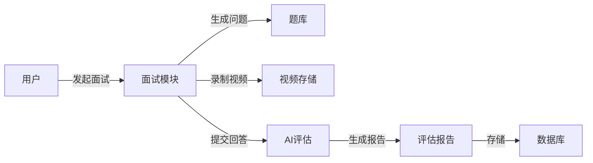

# 面试模拟训练平台 - 需求分析报告

## 一、引言

本报告详细描述面试模拟训练平台的功能需求和非功能需求，作为项目开发的核心依据。

## 二、功能需求

### 2.1 用户角色定义

| 角色 | 描述 |
| :--- | :--- |
| 普通用户 | 求职者，使用平台进行面试训练 |
| 企业用户 | 企业HR，使用平台筛选候选人 |
| 管理员 | 平台运营者，管理内容和用户 |

### 2.2 核心功能模块

#### 2.2.1 用户注册与登录

| 需求编号 | 需求描述 | 优先级 |
| :--- | :--- | :--- |
| REQ-001 | 用户可通过手机号/邮箱注册账号 | 高 |
| REQ-002 | 用户可通过手机号/邮箱+密码登录 | 高 |
| REQ-003 | 支持第三方账号登录（微信/支付宝） | 中 |
| REQ-004 | 支持密码找回功能 | 高 |

#### 2.2.2 模拟面试模块

| 需求编号 | 需求描述 | 优先级 |
| :--- | :--- | :--- |
| REQ-005 | 用户可选择面试岗位类型（技术/产品/运营等） | 高 |
| REQ-006 | 用户可选择面试难度（初级/中级/高级） | 高 |
| REQ-007 | 支持视频面试模式 | 高 |
| REQ-008 | 支持语音面试模式 | 中 |
| REQ-009 | AI面试官自动提问 | 高 |
| REQ-010 | 用户可实时查看面试倒计时 | 高 |
| REQ-011 | 支持面试过程录制与回放 | 中 |

#### 2.2.3 AI评估模块

| 需求编号 | 需求描述 | 优先级 |
| :--- | :--- | :--- |
| REQ-012 | 语音转文字功能 | 高 |
| REQ-013 | 回答内容相关性分析 | 高 |
| REQ-014 | 语速与流利度评估 | 高 |
| REQ-015 | 表情与肢体语言分析 | 中 |
| REQ-016 | 多维度评分（1-10分） | 高 |
| REQ-017 | 生成详细评估报告 | 高 |

#### 2.2.4 题库管理模块

| 需求编号 | 需求描述 | 优先级 |
| :--- | :--- | :--- |
| REQ-018 | 按岗位分类的面试题库 | 高 |
| REQ-019 | 支持题目搜索功能 | 高 |
| REQ-020 | 题目收藏功能 | 中 |
| REQ-021 | 题目练习模式 | 高 |
| REQ-022 | 题目难度标签 | 高 |

#### 2.2.5 学习中心模块

| 需求编号 | 需求描述 | 优先级 |
| :--- | :--- | :--- |
| REQ-023 | 面试技巧文章/视频 | 高 |
| REQ-024 | 面试经验分享社区 | 中 |
| REQ-025 | 个性化学习路径推荐 | 中 |
| REQ-026 | 学习进度追踪 | 高 |

#### 2.2.6 个人中心模块

| 需求编号 | 需求描述 | 优先级 |
| :--- | :--- | :--- |
| REQ-027 | 查看面试历史记录 | 高 |
| REQ-028 | 查看评估报告历史 | 高 |
| REQ-029 | 编辑个人资料 | 高 |
| REQ-030 | 会员套餐管理 | 高 |

#### 2.2.7 企业端功能

| 需求编号 | 需求描述 | 优先级 |
| :--- | :--- | :--- |
| REQ-031 | 企业账号注册与认证 | 高 |
| REQ-032 | 自定义面试题库 | 高 |
| REQ-033 | 查看候选人面试视频 | 高 |
| REQ-034 | 候选人评分与筛选 | 高 |

## 三、非功能需求

### 3.1 性能需求

| 需求编号 | 需求描述 |
| :--- | :--- |
| NFR-001 | 页面加载时间≤2秒 |
| NFR-002 | 视频通话延迟≤200ms |
| NFR-003 | 支持1000+并发用户 |
| NFR-004 | AI评估响应时间≤5秒 |

### 3.2 可用性需求

| 需求编号 | 需求描述 |
| :--- | :--- |
| NFR-005 | 系统可用性≥99.9% |
| NFR-006 | 支持7×24小时服务 |

### 3.3 安全性需求

| 需求编号 | 需求描述 |
| :--- | :--- |
| NFR-007 | 用户数据加密存储 |
| NFR-008 | 视频内容加密传输 |
| NFR-009 | 符合等保三级要求 |

### 3.4 兼容性需求

| 需求编号 | 需求描述 |
| :--- | :--- |
| NFR-010 | 支持主流浏览器（Chrome/Edge/Firefox/Safari） |
| NFR-011 | 支持移动端访问（响应式设计） |

## 四、数据需求

### 4.1 数据实体

| 实体 | 描述 |
| :--- | :--- |
| 用户 | 用户基本信息、注册时间、角色 |
| 面试记录 | 面试ID、用户ID、岗位类型、难度、时间 |
| 评估报告 | 面试ID、各项评分、建议内容 |
| 题目 | 题目ID、岗位类型、难度、问题、答案 |

### 4.2 数据流

## 五、接口需求

### 5.1 内部接口

| 接口名称 | 功能描述 |
| :--- | :--- |
| /api/interview/start | 开始模拟面试 |
| /api/interview/question | 获取下一个问题 |
| /api/interview/submit | 提交回答 |
| /api/assessment/generate | 生成评估报告 |
| /api/questions/search | 搜索题目 |

### 5.2 外部接口

| 接口名称 | 功能描述 |
| :--- | :--- |
| 微信登录API | 第三方登录 |
| 阿里云视频存储 | 视频上传与存储 |
| 语音识别API | 语音转文字 |

---
**编制单位**: 面试模拟训练平台项目组  
**编制日期**: 2026年5月21日