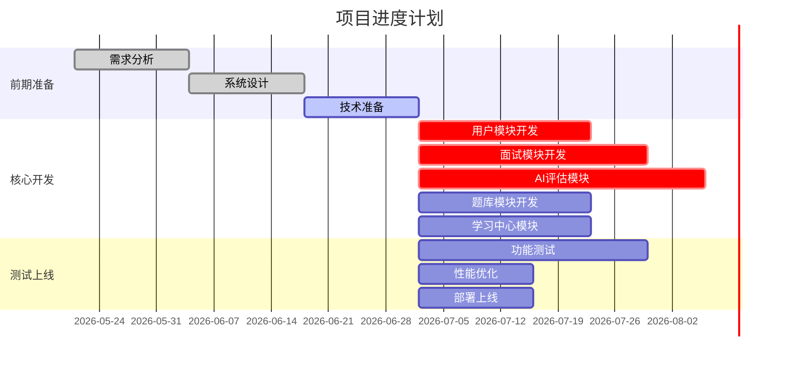
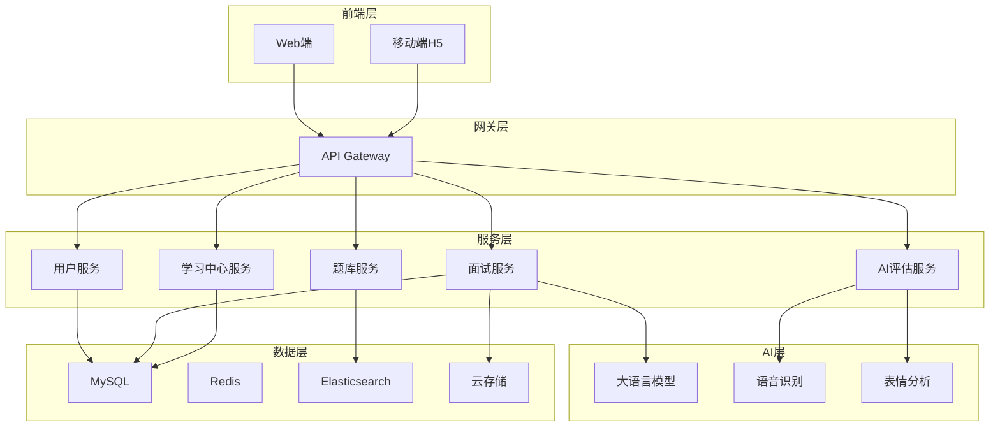

# 面试模拟训练平台 - 项目计划书

## 一、项目概述

### 1.1 项目名称
面试模拟训练平台

### 1.2 项目目标
- 构建AI驱动的面试模拟训练平台
- 实现智能面试评估功能
- 提供个性化学习体验
- 打造国内领先的面试准备工具

### 1.3 项目范围
- Web端应用开发
- 核心AI功能开发
- 移动端适配
- 基础运营体系搭建

## 二、项目计划

### 2.1 项目周期
**总周期**: 10个月

### 2.2 阶段划分

| 阶段 | 时间 | 主要任务 | 里程碑 |
| :--- | :--- | :--- | :--- |
| 需求分析 | 第1-2周 | 需求调研、需求文档编写 | 需求评审通过 |
| 系统设计 | 第3-4周 | 架构设计、数据库设计 | 设计评审通过 |
| 技术准备 | 第5-6周 | 环境搭建、技术选型 | 开发环境就绪 |
| 核心开发 | 第7-20周 | 功能开发、AI集成 | 核心功能完成 |
| 测试优化 | 第21-24周 | 功能测试、性能优化 | 测试报告通过 |
| 上线准备 | 第25-28周 | 部署上线、用户培训 | 内部试运行 |
| 正式上线 | 第29-30周 | 公开上线、运营启动 | 正式发布 |

### 2.3 详细进度计划（甘特图）

## 三、资源计划

### 3.1 人员安排

| 角色 | 人数 | 职责 |
| :--- | :--- | :--- |
| 项目经理 | 1 | 项目统筹、进度把控 |
| 产品经理 | 2 | 需求分析、产品设计 |
| 前端开发 | 3 | Web端前端开发 |
| 后端开发 | 3 | 后端服务开发 |
| AI工程师 | 2 | AI模型开发与集成 |
| 测试工程师 | 2 | 功能测试、性能测试 |
| UI设计师 | 1 | 界面设计、交互设计 |
| **总计** | **14** | |

### 3.2 技术资源

| 资源类型 | 具体内容 |
| :--- | :--- |
| 前端框架 | React 18 + TypeScript |
| 后端框架 | Spring Boot 3.x |
| 数据库 | MySQL 8.0 + Redis 7.0 + Elasticsearch |
| AI平台 | OpenAI API / 阿里云PAI |
| 云服务 | 阿里云ECS + 云存储 + CDN |

### 3.3 预算计划

| 类别 | 金额（万元） | 说明 |
| :--- | :--- | :--- |
| 人员成本 | 140 | 14人×10个月 |
| 云服务 | 20 | 服务器、存储、带宽 |
| AI服务 | 15 | API调用费用 |
| 测试设备 | 5 | 测试手机、设备 |
| 其他费用 | 10 | 培训、会议、差旅 |
| **总计** | **190** | |

## 四、技术方案

### 4.1 系统架构

### 4.2 关键技术点

| 技术点 | 实现方案 |
| :--- | :--- |
| AI面试官 | 基于GPT-4/Claude 3构建智能提问引擎 |
| 语音分析 | Whisper语音识别 + 情感分析模型 |
| 表情识别 | MediaPipe + 自定义深度学习模型 |
| 实时通信 | WebRTC + 阿里云视频通话SDK |
| 高并发 | 微服务架构 + 负载均衡 |

## 五、质量保证

### 5.1 测试计划

| 测试类型 | 覆盖范围 | 测试方法 |
| :--- | :--- | :--- |
| 单元测试 | 核心算法、工具函数 | 自动化测试 |
| 集成测试 | 服务间接口 | 接口测试工具 |
| 系统测试 | 完整业务流程 | 自动化+手动 |
| 性能测试 | 并发、响应时间 | JMeter/LoadRunner |
| 安全测试 | 漏洞扫描、渗透测试 | 安全测试工具 |

### 5.2 质量标准

| 指标 | 标准 |
| :--- | :--- |
| 代码覆盖率 | ≥80% |
| 接口成功率 | ≥99.9% |
| 用户满意度 | ≥90% |
| Bug修复周期 | ≤24小时（严重） |

## 六、风险管理

### 6.1 风险识别与应对

| 风险 | 概率 | 影响 | 应对措施 |
| :--- | :--- | :--- | :--- |
| AI模型效果不佳 | 中 | 高 | 预留优化时间，建立人工审核机制 |
| 技术人员流失 | 低 | 中 | 完善激励机制，做好知识沉淀 |
| 用户增长不及预期 | 中 | 中 | 制定多渠道推广策略 |
| 技术架构问题 | 低 | 高 | 前期充分设计评审 |

### 6.2 应急预案

- **服务器故障**: 多可用区部署，自动故障转移
- **数据丢失**: 每日备份，异地容灾
- **突发流量**: 弹性伸缩，CDN加速

## 七、沟通计划

### 7.1 会议安排

| 会议类型 | 频率 | 参与人员 |
| :--- | :--- | :--- |
| 每日站会 | 每天 | 开发团队 |
| 周进度会 | 每周 | 全体成员 |
| 月度评审会 | 每月 | 项目组+管理层 |

### 7.2 报告机制

| 报告类型 | 频率 | 内容 |
| :--- | :--- | :--- |
| 日报 | 每天 | 进度、问题、计划 |
| 周报 | 每周 | 周进度汇总 |
| 月报 | 每月 | 项目状态、风险评估 |

## 八、项目验收

### 8.1 验收标准

| 阶段 | 验收内容 | 验收方式 |
| :--- | :--- | :--- |
| 需求阶段 | 需求文档 | 评审会 |
| 设计阶段 | 设计文档 | 评审会 |
| 开发阶段 | 功能实现 | 功能测试 |
| 上线阶段 | 系统稳定性 | 性能测试 |

### 8.2 交付物清单

| 交付物 | 说明 |
| :--- | :--- |
| 需求分析报告 | 详细需求文档 |
| 系统设计文档 | 架构、数据库设计 |
| 源代码 | 完整项目代码 |
| 测试报告 | 功能、性能测试报告 |
| 用户手册 | 平台使用说明 |

---
**编制单位**: 面试模拟训练平台项目组  
**编制日期**: 2026年5月21日